<a href="https://www.shobserver.com/toutiao/html/115104.html?group_id=6621114274582364680&app=">上港冠军之路图文集：这个让上海球迷苦盼了23年的冠军，究竟是怎样炼成的？</a>
<h1>上港冠军之路图文集：这个让上海球迷苦盼了23年的冠军，究竟是怎样炼成的？</h1>

2018年11月7日，上海足坛终于等来了再度圆梦的一刻，迎来了久违了的顶级联赛冠军！这是中超联赛自2004年成立以来，上海球队首次捧起冠军奖杯！

稍年长的上海球迷，想必都记得1995年徐根宝率领申花众弟子，凭借&quot;抢、逼、围&quot;，勇夺甲A冠军的一幕。

弹指一挥，已然23载。

23年来，上海再也没在顶级足球联赛染指冠军。23年，为这个冠军，上海等得太久了。

武磊说过，“我们老东亚、崇明那一批十几年都在一起，一直有这个梦想，就是大家一起拿一次中超冠军、亚冠冠军，这样才算圆满，也能够证明徐指导带我们这批人的成就。”

可以说，武磊等人的圆梦历程，是上港上海众将士从稚嫩到成熟的成长历程，是上港俱乐部以青训立命、一步一个脚印的奋斗历程，更是当初徐根宝艰苦卓绝、十年磨一剑收获的甜美果实。

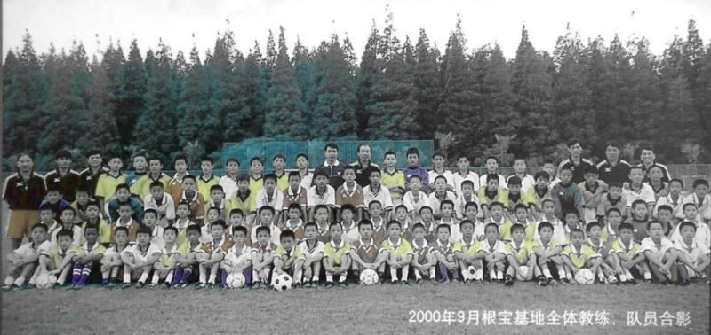

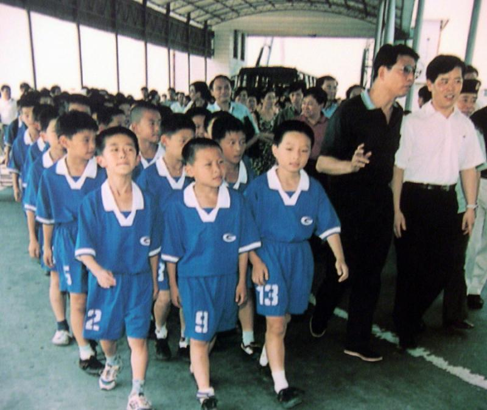

<em>（图说：2000年，徐根宝结缘福地崇明岛，得到当时崇明县领导倾力支持。是年6月1日，根宝足球基地在崇明腹地破土动工，由此开端，这片肥沃的土壤见证了&quot;十年磨一剑&quot;、&quot;缔造中国曼联&quot;的伟大尝试。）</em>

在这欢庆的时刻，不妨来回顾上港的&quot;奋斗史&quot;，探寻这个上海球迷苦苦期盼了23年的中超冠军，究竟是怎样炼成的？

上海上港俱乐部的前身——上海东亚俱乐部2005年成立，徐根宝誓将俱乐部打造成&quot;中国曼联&quot;。当时最大的队员才17岁，普遍在15、16岁。

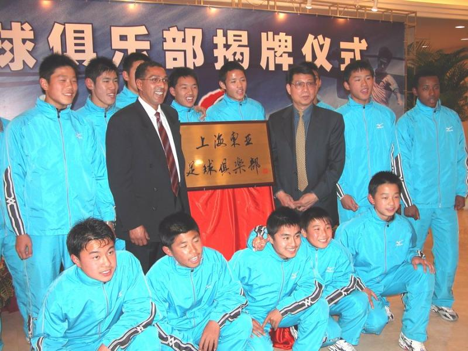

<em>（图说：2005年年底，上海东亚队成立，徐根宝以俱乐部主席和公司董事长身份宣布球队将于次年参加乙级联赛，“这不是’亮剑’，是到市场上去’磨剑’，同时我也要看一看，足球市场还有没有可能重新振兴…”）</em>

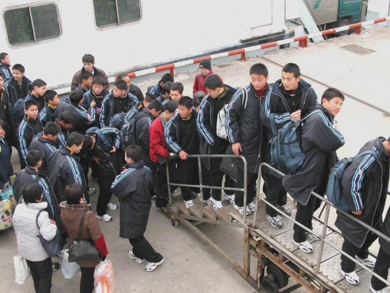

<em>（图说：2005年初摄于崇明某码头）</em>

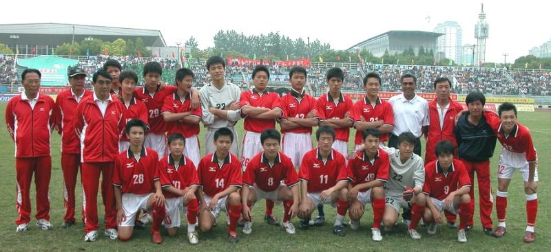

<em>（图说：2006年5月6日，&quot;中国曼联&quot;以上海东亚队身份首次在职业赛场上亮相，他们年轻、拘谨、身体单薄、心态复杂…做客安徽合肥，很快在一群健壮的成人球员面前输掉了比赛，不过徐根宝等还是受到了热烈欢迎，他的队伍告诉足坛，不管开局多么艰难，我们来了！）</em>

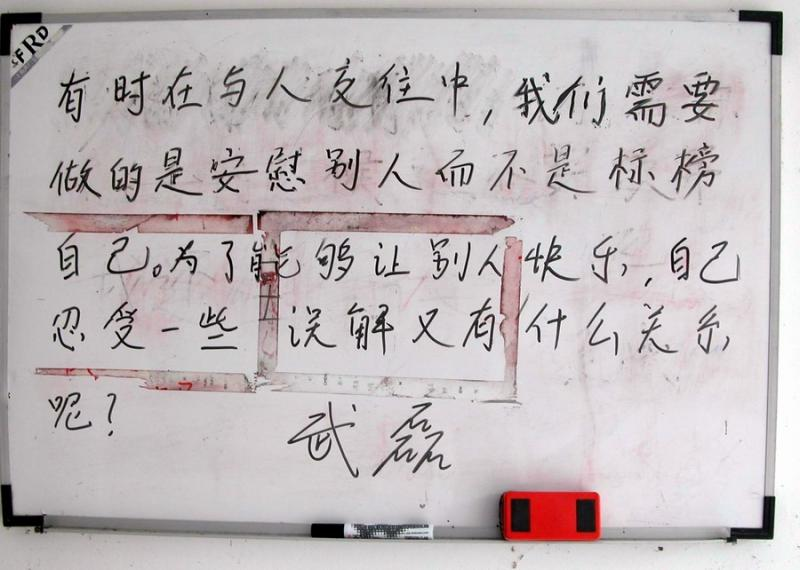

2007年，徐根宝出任东亚队总教练，蒋炳尧、刘军、章冠兴组成了执行教练组协助工作。该年上海东亚被分到中乙联赛北区，以9胜3平2负的成绩取得北区冠军，并在决赛阶段先后战胜安徽九华山与四川队，最终夺得中乙联赛冠军，成功升入中国足球甲级联赛。

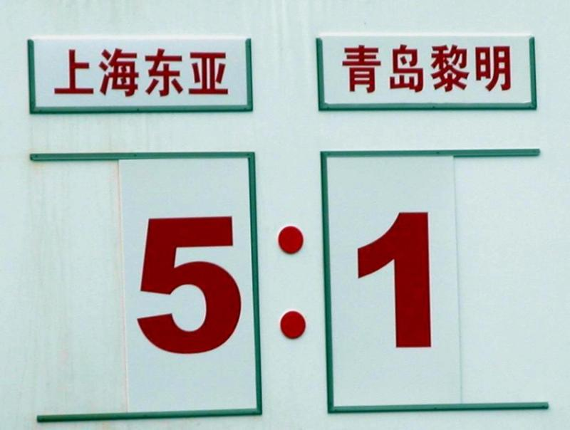

<em>（图说：2007年5月5日，新赛季乙级联赛开始，去年仅列南区倒数第三的东亚队提出冲甲目标。首轮他们主场5比1大胜青岛黎明，以焕然一新的面貌开始了疯狂的征程…）</em>

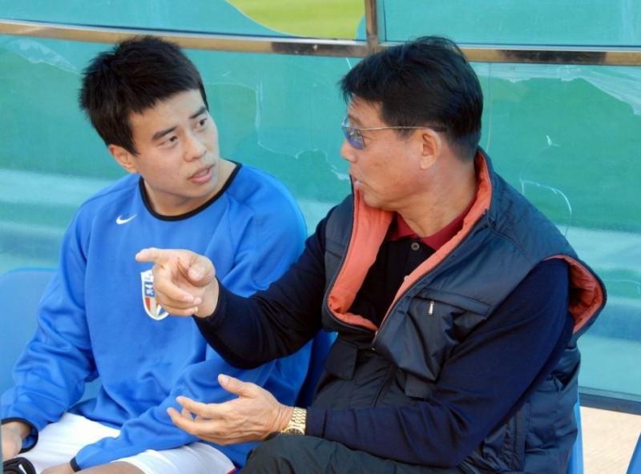

<em>（图说：2007年11月7日，主帅吴金贵率领以替补队员为主的申花队在康桥基地和东亚队打了一场训练赛，以此为&quot;中国曼联&quot;的冲甲征途饯行——次日，徐根宝将率领上海东亚队出征昆明，参加2007中国足协乙级联赛决赛阶段比赛。&quot;你们一定能冲甲成功！&quot;从吴金贵到孙吉等昔日弟子，都对根宝麾下的这支新生力量非常看好，而根宝也投桃报李，祝愿申花队最后取得好成绩，能进军亚冠联赛。）</em>

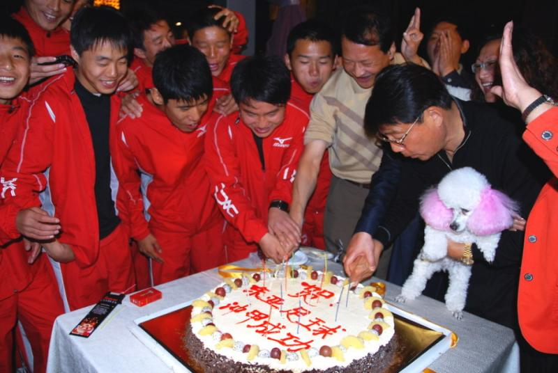

（图说：冲甲成功那一晚，徐根宝和弟子们举杯欢庆，一不留神，被俱乐部官员和球员们&quot;袭击&quot;，蛋糕抹了一脸…）

2008年，上海东亚队将主场设在可容纳3万人的上海第二个专业足球场金山足球场，并由蒋炳尧出任球队主教练。该年首次参加中甲联赛的东亚队最终取得第六名。

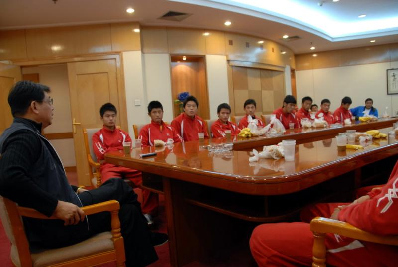

<em>（图说：2008年，中甲赛季最后阶段面对马良行率领的无锡中邦队，根宝在赛前开了一个准备会，提醒队员们要全力以赴。）</em>

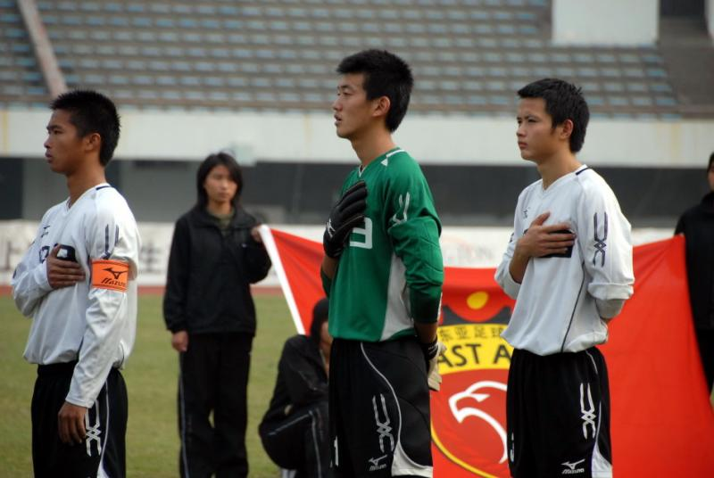

<em>（图说：那场比赛中，颜骏凌扑出对手多个必进球，&quot;你们那个守门员也太厉害了！&quot;马良行赛后东亚队的教练们握着手感慨。）</em>

2009年，东亚的主场搬到了上海地区观众容量最大的上海体育场。由于要为年中的全运会做准备，该年球队仍未引进内外援，继续以全华班出战中甲。2009年8月1日，以东亚队为班底的上海队在第十一届全运会男足甲组决赛中3比0战胜广东队，夺得冠军。当年中甲联赛，东亚队在一度占据冲超领先地位的情况下未能成功升级，最终排名第四。

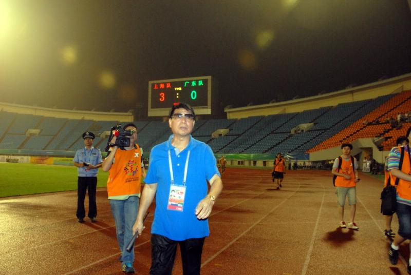

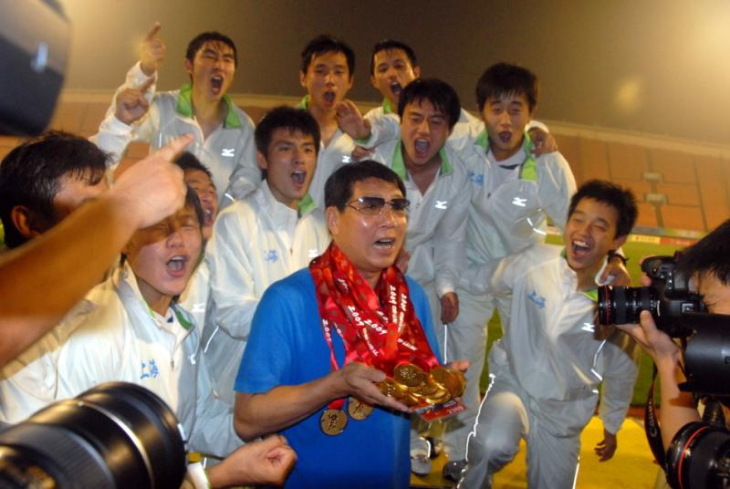

（图说：2009年8月1日，在山东省体育中心，随着张琳芃、吕文君和战怡麟三个漂亮的进球，徐根宝率领的上海男足全运队力克广东获得冠军，这是上海男足时隔26年后重吻全运会金牌，更为难得的是，这一辉煌是在核心球员无法上阵，瓢泼大雨完全打乱了战前部署的情况下获得的。）

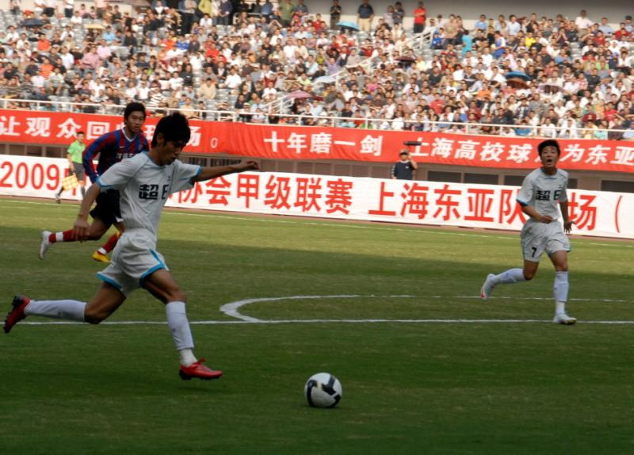

（图说：2009年10月，与沈阳东进的关键一战失利，宣告东亚冲超失败。那个赛季面对排名靠前的对手辽宁、南昌、沈阳、广东队，东亚的战绩都不好，证明当时的东亚&quot;水未到，渠没成&quot;。但也无法掩盖这群小伙子在中甲、全运会双线作战的前提下取得的成绩。）

2010年联赛开始前，东亚提出了&quot;冲超&quot;的目标，首次引进三名外援，并由范志毅接任球队主教练。2010赛季，球队最终取得联赛第四名，未能冲进中超。赛季结束后范志毅向俱乐部提出辞呈，徐根宝重新任命蒋炳尧担任球队主教练，并出售3名主力球员以筹措资金，其中队长王佳玉和姜至鹏转会至南昌衡源，副队长、队中首位国脚张琳芃转会至广州恒大。同年12月，在上海市体育局的协调下，上海东亚和上海中邦进行战略合作：中邦的优秀球员优先转会至东亚，由中邦承担十二运男足甲组球队的备战任务，聘请成耀东担任球队主教练，上海全运队（东亚梯队）以浦东中邦队的名义征战新赛季的中乙联赛。

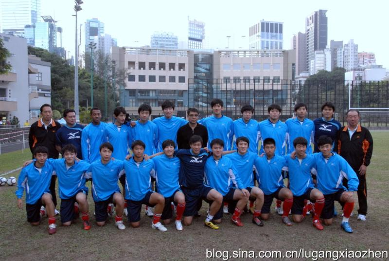

(图说，2010年11月，上海东亚首次代表上海参加沪港球会杯足球赛，两回合总比分5比3击败香港公民，获得冠军。）

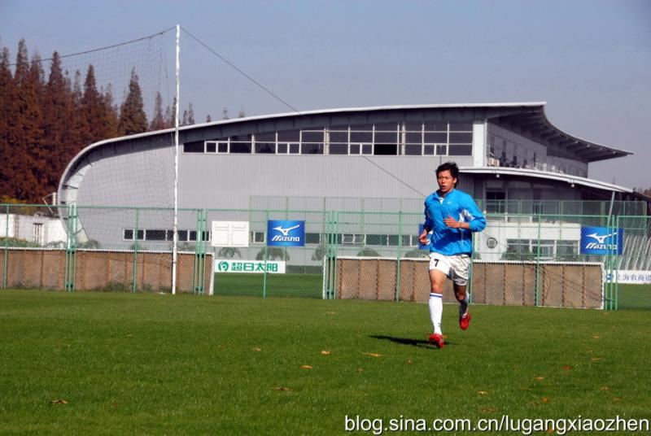

<em>（图说：张琳芃在崇明根宝基地的最后一练。）</em>

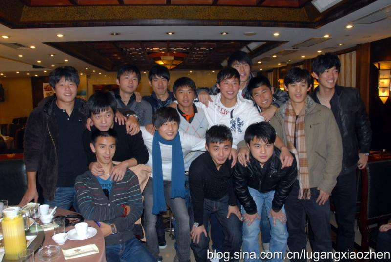

<em>(图说：2010年年底张琳芃离开东亚前，队友们为张琳芃送行。)</em>

2011年联赛开始前，中场主力曹赟定转会至同城的中超球队上海申花，而门将顾超转会至杭州绿城。2011赛季，失去五多名主力的东亚队在联赛中表现不佳，最终只获得第九名。该赛季武磊以12个进球成为中甲本土射手王。

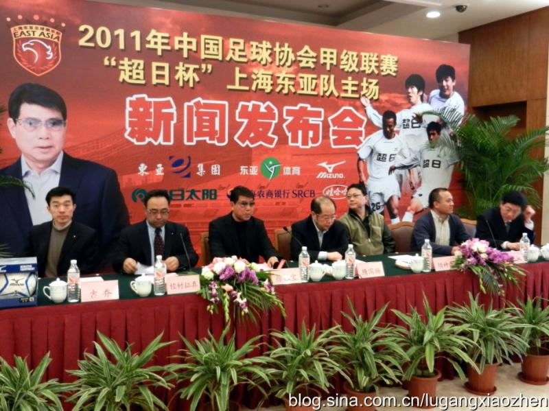

经过三年的卧薪尝胆，在上至根宝，下至普通员工的戮力同心下，众志成城。2012赛季，联赛十五轮后，东亚以领先第二名湖南湘涛7分的优势获得半程冠军，2012年9月29日，上海东亚客场3比0战胜哈尔滨毅腾后，提前三轮冲超成功，这时距离球队成立不到七年时间。该赛季武磊以17个进球卫冕中甲本土最佳射手。

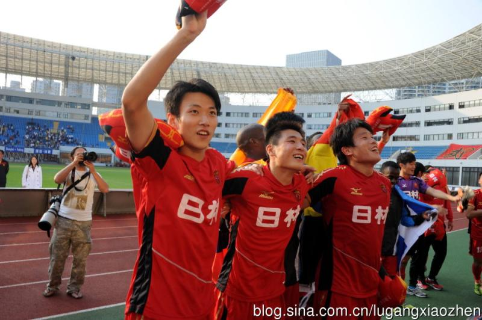

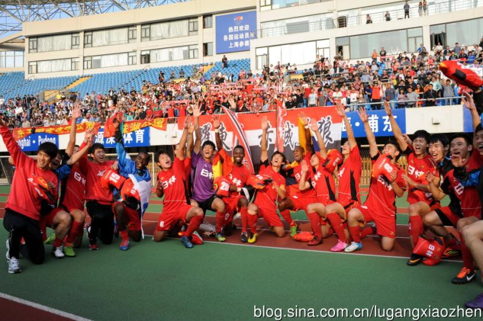

<em>（图说：冲超成功的那一刻，是东亚这群小伙子们和球迷们最美好的记忆。）</em>

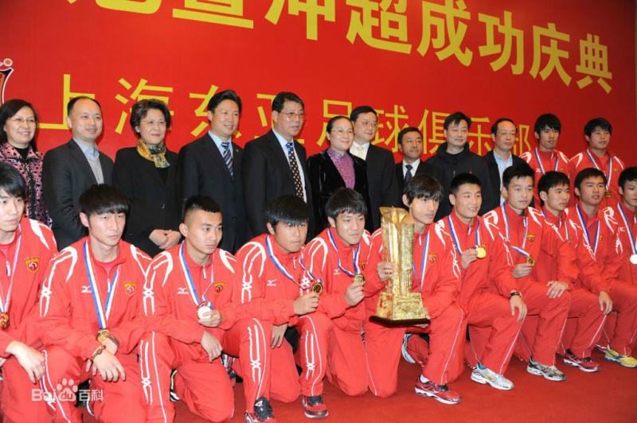

<em>（图说：2012年11月12日，上海东亚足球俱乐部举行中甲夺冠暨冲超成功庆典，市领导出席并向球队颁发奖杯，东亚全体队员的被授予了冠军奖牌。同年12月21日，奚志康进入东亚教练组，协助总教练徐根宝工作。12月28日，在相关政府部门的&quot;协调&quot;下，上海东亚足球俱乐部得到了上港集团的冠名赞助；同时徐根宝正式提出了&quot;631&quot;计划，即&quot;在中超第一年力争前六，第二年跻身前三，第三年夺冠。&quot;）</em>

2013赛季，上海东亚足球俱乐部以上海上港队的名义，征战中国足球超级联赛和中国足协杯赛等全年各类赛事。2013年2月27日，球队举行新闻发布会，宣布高洪波为上港队新赛季的主教练。9月10日，在第十二届全运会男足甲组决赛中，以东亚预备队为班底的上海队加时赛1比0战胜东道主辽宁队，成为第一支蝉联全运会男子足球比赛冠军的球队。该年中超联赛，球队最终取得第九名，未达到赛季前制定的&quot;631&quot;目标；武磊凭借创中超记录的单赛季三次&quot;帽子戏法&quot;和打进15球的优异表现，获得中超本土最佳射手奖。

同年年末，徐根宝提出为了俱乐部的长远发展，希望赞助商上港集团收购俱乐部。此后，上海上港队明确了&quot;新赛季争取中超前三，冲击亚冠名额&quot;的目标。

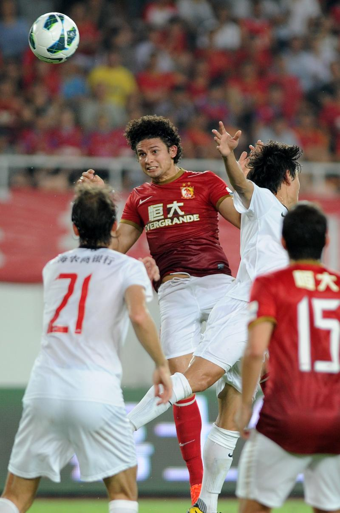

<em>（图说：2013年6月25日，在2013年中超联赛第14轮比赛中，广州恒大队主场以1比0战胜上海上港队，恒大外援埃尔克森(左二)打进关键进球，这也是上港升入中超后第一次与恒大扳手腕。）</em>

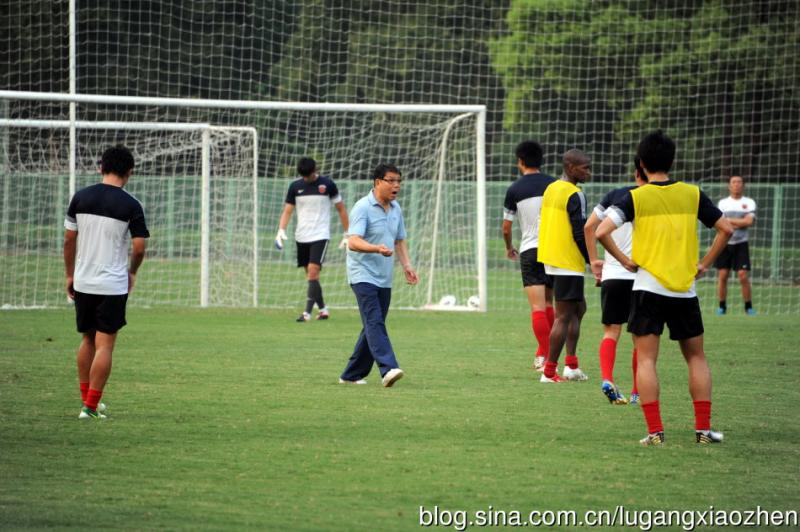

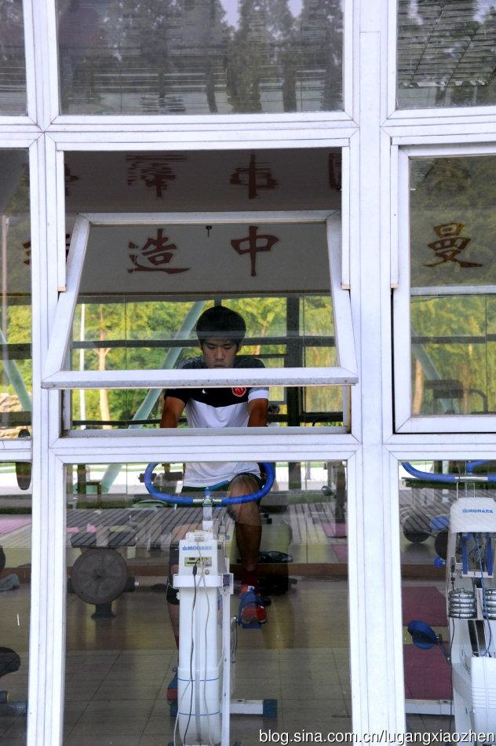

<em>（图说：高温天，上港众将士在崇民基地训练。）</em>

2014赛季，上海上港队仅因为净胜球的劣势屈居联赛第五名，未能完成&quot;获得亚冠名额&quot;的目标，但联赛排名位列上海三支中超球队首位；瑞典外援海森以19球斩获中超射手榜铜靴，打进12球的武磊蝉联中超本土最佳射手。

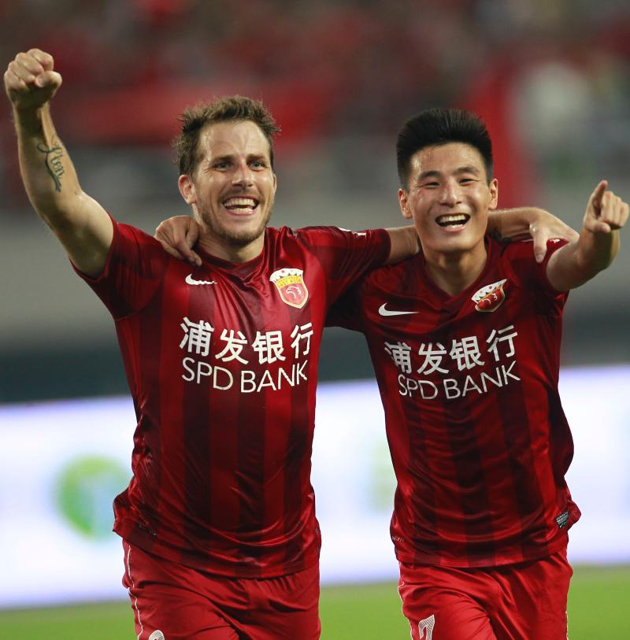

<em>（图说：2014年8月3日，上海上港队球员海森(左)和武磊在比赛中庆祝进球。当日，在2014赛季中超联赛第18轮比赛中，上海上港队主场以2比1战胜杭州绿城队。）</em>

2014年10月，上港集团以近2亿元全资收购上海东亚足球俱乐部，收购对象包括一线队、预备队和U17梯队。此后，上港收购了沪上知名青训单位上海幸运星足球俱乐部的U17、U15梯队，获得了第十三届全运会上海男子足球队（甲组）的组队权，并由成耀东二度出任上海队主教练。

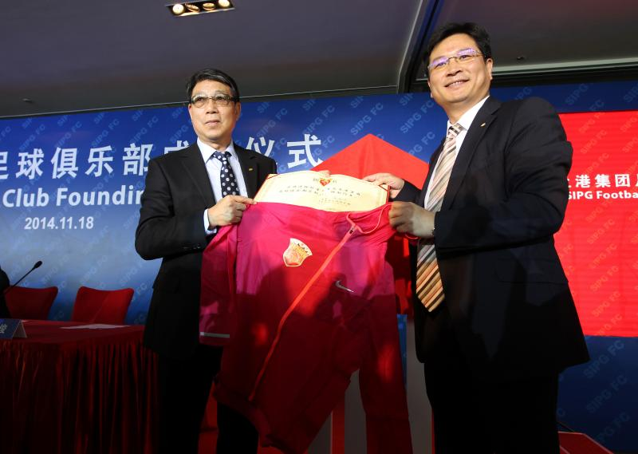

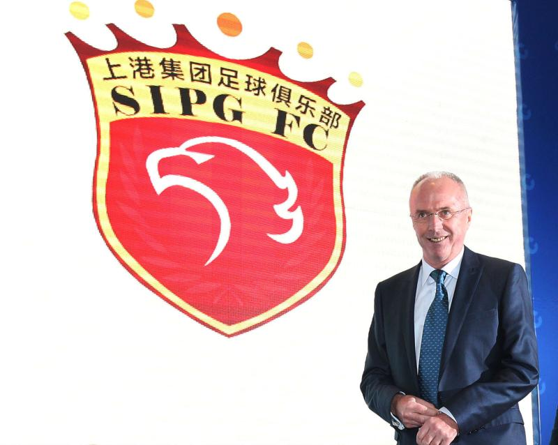

<em>（图说：2014年11月18日，上海上港集团足球俱乐部成立仪式暨新闻发布会在上海港国际客运中心举行，发布会宣布，球队新一任主教练为瑞典名帅埃里克森，领队兼中方教练为奚志康，聘请徐根宝担任俱乐部总顾问。12月7日，上港全队正式入驻上海市体育局所属的东方绿舟体育训练基地。）</em>

2015赛季开始前，上海上港先后引进孙祥、金周荣、孔卡、于海、石柯、埃弗拉等8名内外援补强阵容，并在新赛季中超联赛动员大会上提出了&quot;进军2016年亚冠&quot;的目标。2015赛季，球队在联赛前三轮取得三连胜，创队史中超最佳开局。联赛第14轮至第19轮，球队取得六连胜，平队史联赛连胜纪录。赛季中期，球队引进了加纳国家队队长吉安·阿萨莫阿。

9月12日联赛第25轮，位居榜首的上海上港在主场对阵广州恒大淘宝的争冠关键战中0比3落败；此役过后，上港积52分落后恒大2分，退居联赛第二名。2015年10月31日，上海上港在主场2-1战胜辽宁宏运，最终以30战积65分夺得中超联赛亚军，首获亚冠参赛资格，这是上港俱乐部建队十年以来取得的职业联赛最佳战绩。该赛季武磊以14个进球第三次蝉联中超本土最佳射手。

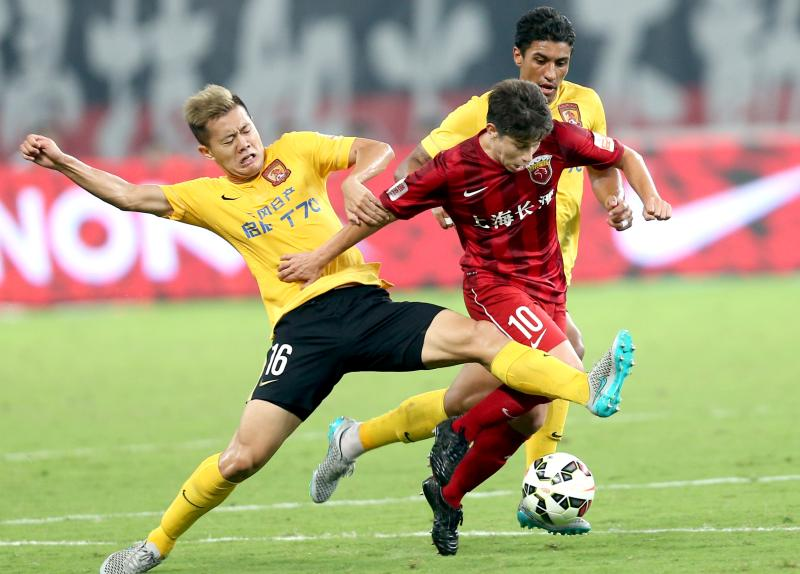

<em>（图说：2015年9月12日，在中超联赛第25轮比赛中，上海上港队主场以0比3不敌广州恒大淘宝队。）</em>

2016年2月9日，上港在主场进行的亚冠附加赛中3比0战胜蒙通联，顺利进入亚冠小组赛。3月2日，上港在主场2比1战胜水原三星，赢得队史亚冠正赛首胜。此后，上海上港在亚冠赛场面对韩日澳球队取得三连胜，积12分提前一轮锁定小组头名出线，成为2009赛季亚冠改制后首支小组赛阶段取得四连胜的中超球队。

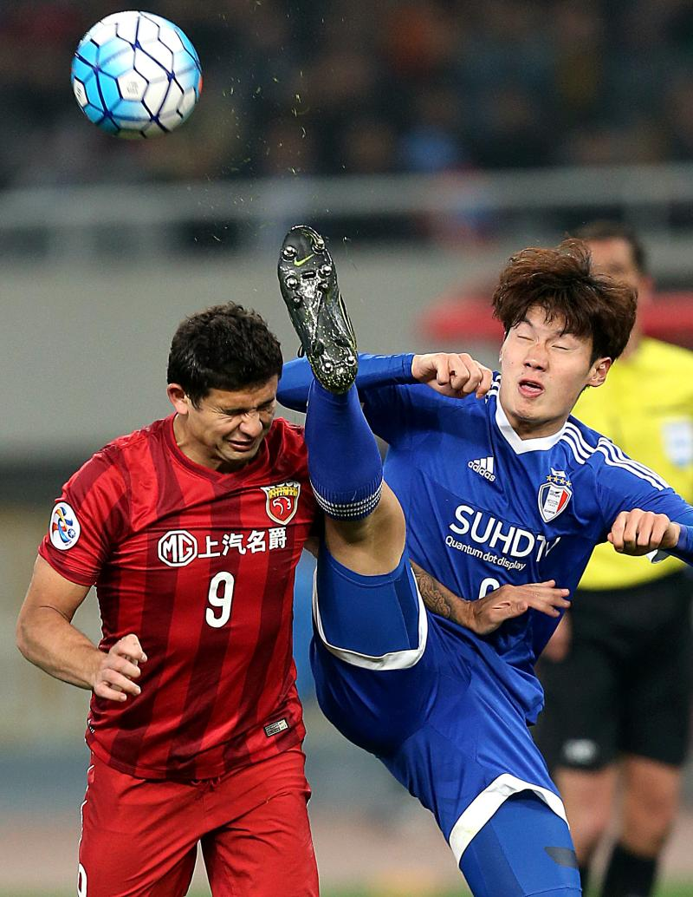

<em>（图说：上2016年3月2日，在2016年亚冠联赛小组赛G组第二轮比赛中，中国上海上港队主场以2比1战胜韩国水原三星蓝翼队，获得了亚冠首胜。）</em>

5月24日，在2016亚冠1/8决赛次回合比赛中，上海上港队在主场1比0战胜东京FC队（总比分战成2比2），凭借客场进球多晋级八强，这是上海球队时隔十年之后再次晋级1/4决赛。赛季中期，上港俱乐部以5600万欧元的中超最高身价引进了圣彼得堡泽尼特前锋、巴西国脚浩克。赛季结束，上港预备队首夺中超预备队联赛冠军；上港一队获得中超季军；武磊以14球连续四年加冕中超本土金靴。

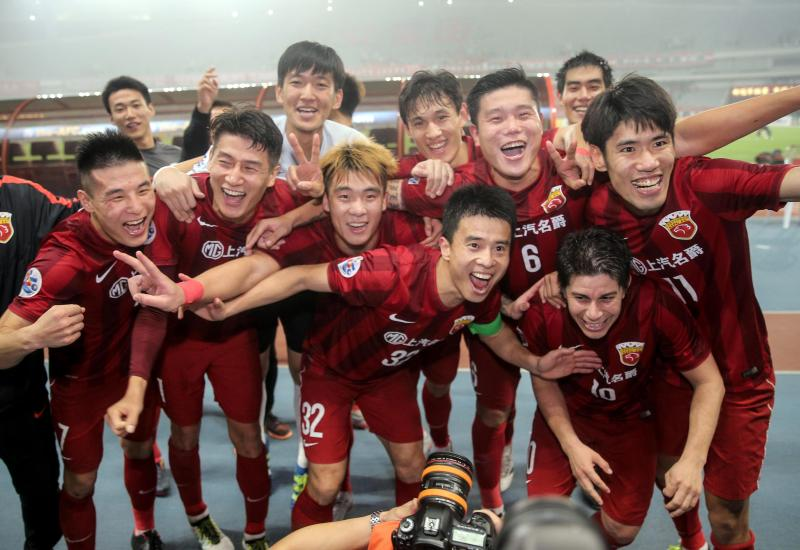

11月4日，上港正式宣布葡萄牙名帅维拉斯·博阿斯出任球队新赛季主教练。12月23日，上港宣布签约切尔西中场球星奥斯卡，转会费为6100万欧元，成中超新标王。

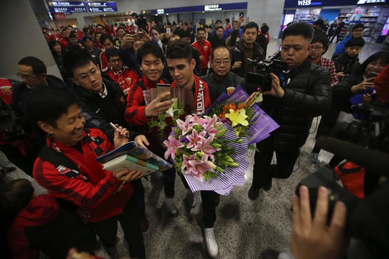

（图说：2017年1月2日，巴西球员奥斯卡抵达上海浦东国际机场。2016年12月23日，中超上港俱乐部与英超切尔西俱乐部完成关于奥斯卡的转会协议。）

2017年9月12日亚冠1/4决赛次回合，上海上港客场迎战广州恒大，最终通过点球大战以两回合总比分10比9战胜对手，队史上首次跻身亚冠四强。

该赛季，上港最终以58分的成绩排名中超联赛第二名，72个进球在所有球队中排名第一，也创造了球队征战中超联赛以来的进球纪录；颜骏凌当选中超最佳门将，武磊以20球连续5年获中超本土最佳射手。

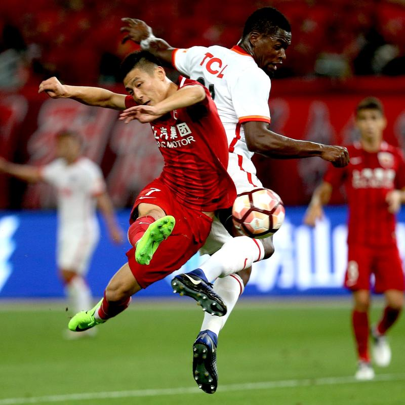

11月26日的中国足协杯决赛第二回合，虽然上港在主场3比2力克上海绿地申花（总比分3-3），但是由于申花客场进球的优势，上港无缘足协杯冠军。12月12日，上港正式宣布葡萄牙人维托尔·佩雷拉出任球队的新主帅。

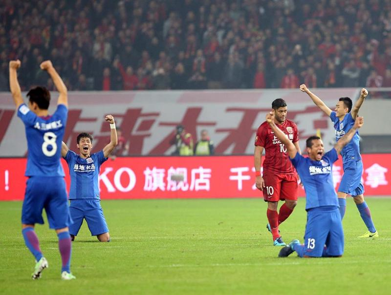

2018年3月3日，上海上港在中超首轮主场8比0大胜大连一方，创队史最大比分胜利纪录，改写中超最大分差纪录，追平了中国顶级职业联赛的分差记录（8个球），也是中国顶级职业联赛史上首轮比赛中出现的最大比分胜利和最多进球数比赛。

11月3日的中超第28轮比赛，上海上港在客场以5比4战胜卫冕冠军广州恒大队，比赛一波三折。最终，上海上港队实现单赛季对广州恒大的主客场双杀，5分的领先优势也宣告，上港终于实现了超越，登上了中国足坛之巅。

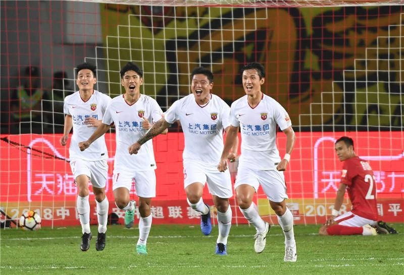

